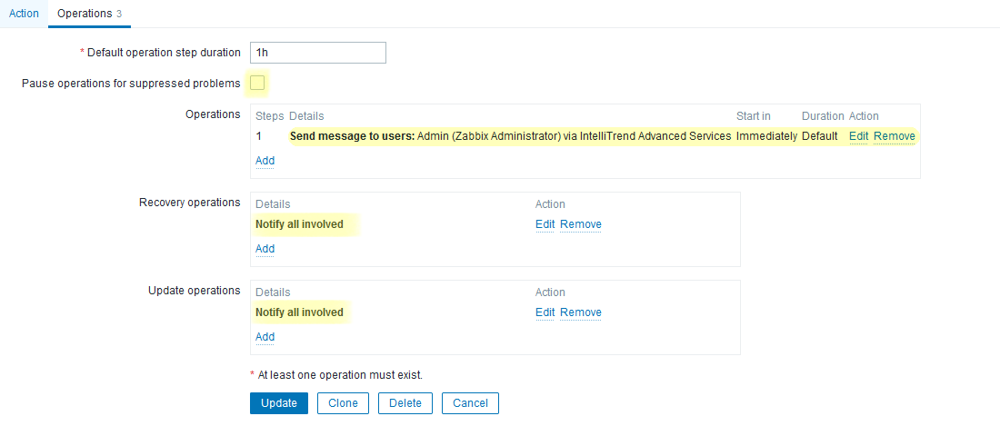
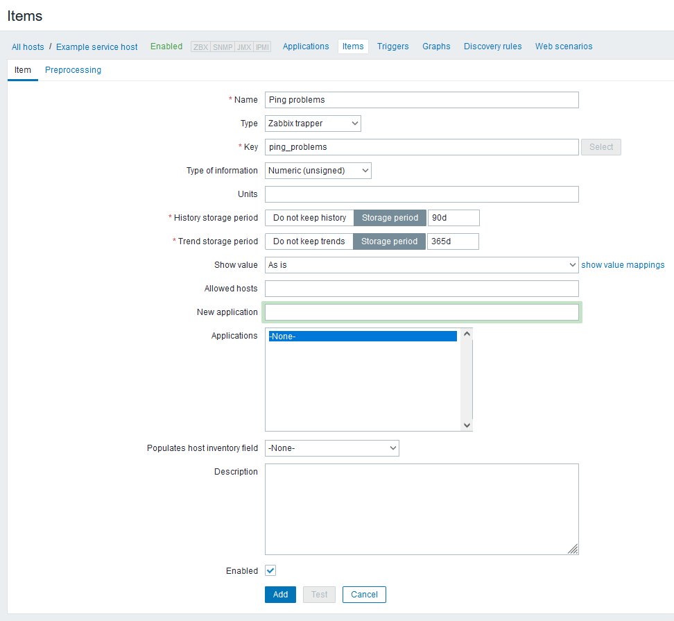
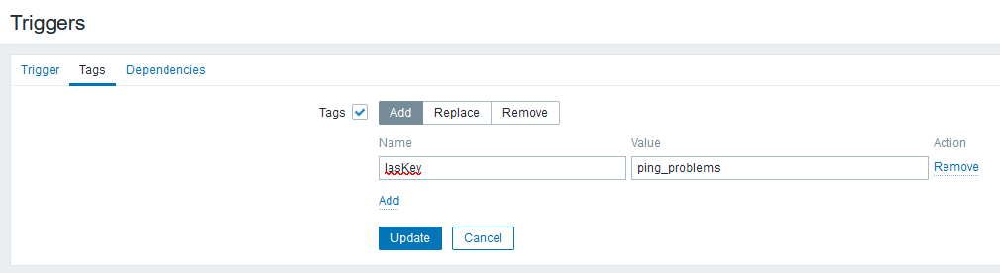
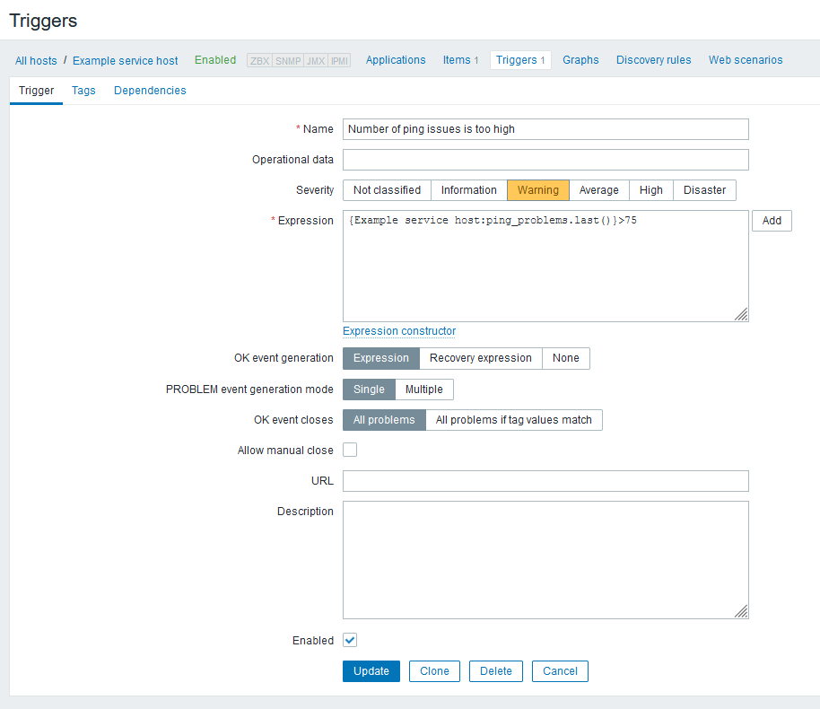
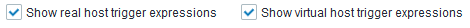

# IAS - IntelliTrend Advanced Services

| Version  | Date       | Author          | Change                                  |
| -------- | ---------- | --------------- | --------------------------------------- |
| 1.0.0    | 2021-05-04 | Nico Bergemann  | Initial revision                        |
| 1.1.0    | 2021-05-21 | Nico Bergemann  | Updated doc to cover changes for 5.1.2  |
| 1.2.0    | 2021-09-20 | Nico Bergemann  | Updated doc to cover changes for 5.2.6  |
| 1.3.0    | 2022-10-05 | Nico Bergemann  | Updated doc for release 6.x             |

## Development

This project was developed by:
```
IntelliTrend GmbH
Otto-Brenner-Str. 119
33607 Bielefeld
Germany
https://www.intellitrend.de
```

------

[TOC]

# Changelog

## 6.0.1
  - Fixed a crash when background updates and web API request collide
  - Fixed a frontend module bug when HTTP errors are displayed as "[object Object]"

## 6.0.0
  - Added support for Zabbix 6.0
  - Added support for high-availability introduced in Zabbix 6.0
  - Added background task to regularily send service item values to the Zabbix server
  - Introduced global macro `{$IAS_URL}` to set the IAS backend API URL for the Zabbix frontend module and media type automatically
  - Improved service data caching for improved performance in the frontend

## 5.2.6
  - Added missing context for item links in Zabbix 5.4, removed it from services where it's not needed
  - Escaping "&" in HTML links
  - Added enhanced detection for misconfiguration

## 5.2.0
  - Internal release
  - Added support for Zabbix 5.4

## 5.1.2
  - Added support for non-superadmin-user

## 5.1.0
  - Internal release
  - Added support for Zabbix 5.2
  - Added visual flowcharts

## 5.0.0
  - Internal release
  - Initial release, compatible with Zabbix 5.0


# About

IAS adds advanced service monitoring to Zabbix. It allows configuring complex dependencies between single hosts or groups of hosts that build a service.


These services are presented in Zabbix using a diagram that is generated based on the current configuration.


# Installation

IAS - IntelliTrend Advanced Services consists of two core components:

- Backend server services component: Communicates with Zabbix through the Zabbix-API and performs the calculations, implemented as a service
- Web Frontend module component: Communicates with the backend component, implemented as a Zabbix Frontend module


## Installations steps summary:

1. Install the binaries on the Zabbix server host.

    - Copy the intellitrend-advanced-services binaries and service
    - Grant executable permissions
    - Customize intellitrend-advanced-services.yaml, especially the Zabbix URL and API credentials.
    - Start the intellitrend-advanced-services service

1. Installation of the Zabbix web frontend module
1. Installation and configuration of Zabbix

    - Adjust Zabbix web frontend config
    - Import the media type
    - Creation of a Service User
    - Creation of the trigger action

## Installation of the IAS binary

### Copy the files

From the directories of the extracted IAS package, create the IAS system directories and copy the files on the Zabbix server host.

```bash
mkdir -p /usr/local/intellitrend/ias/bin/
mkdir -p /usr/local/intellitrend/ias/etc/
cp backend/intellitrend-advanced-services /usr/local/intellitrend/ias/bin/intellitrend-advanced-services
cp backend/intellitrend-advanced-services.service /etc/systemd/system/intellitrend-advanced-services.service
cp backend/intellitrend-advanced-services.yaml /usr/local/intellitrend/ias/etc/intellitrend-advanced-services.yaml
```

Restart systemd daemon to load new service files:

```bash
systemctl daemon-reload
```

### Grant executable permissions

The ``intellitrend-advanced-services`` binary has to be executable and owned by the user root.

```bash
chmod +x /usr/local/intellitrend/ias/bin/intellitrend-advanced-services
chown root:root /usr/local/intellitrend/ias/bin/intellitrend-advanced-services
```

### Configuration of intellitrend-advanced-services.yaml

There are two ways to configure IAS:

* Configuration via command line arguments
* Configuration via YAML config file (``/usr/local/intellitrend/ias/etc/intellitrend-advanced-services.yaml``)

The latter is the recommended way, especially when IAS is running as a daemon.

For configuration, the following options are available:

| YAML                 | CLI                       | Type   | Default   | Purpose                                                                                                       |
| -------------------- | ------------------------  | ------ | --------- | ------------------------------------------------------------------------------------------------------------  |
| allowedHosts         | --allowed-hosts           | string |           | Comma-separated list of hosts that are allowed to access the backend web API.                                 |
| cronRefresh          | --cron-refresh            | string |           | Cron rule for refreshing cached data from the Zabbix server.                                                  |
| cronSendItems        | --cron-send-items         | string |           | Cron rule for sending service item values to the Zabbix server.                                               |
| cronUpdateHA         | --cron-update-ha          | string | LR        | Cron rule for updating the high-availability status.                                                          |
| graphDirection       | --graph-direction         | string |           | Direction of the dashboard graph. Can be 'LR', 'RL', 'TD' or 'BT'.                                            |
| licensePath          | --license-path            | string | ias.lic   | Path to license file.                                                                                         |
| listenIP             | --listen-ip               | string |           | Webhook listen address, leave empty to listen to any interface.                                               |
| listenPort           | --listen-port             | uint16 | 3900      | Webhook listen port.                                                                                          |
| listenURL            | --listen-url              | string | 4         | HTTP URL where this IAS web server is externally reachable from the Zabbix webserver.                         |
| logLevel             | --log-level               | uint   | 16        | Log Level of the IRS-API-Server to control verbosity. Ranges from 0 (crashes only) to 6 (trace).              |
| maxTreeDepth         | --max-tree-depth          | uint   |           | Maximum allowed depth of a service tree, starting from the topmost trigger.                                   |
| nodeName             | --node-name               | string |           | Name of the Zabbix server node to bind this IAS instance to. If empty, the first active node will be used.    |
| serviceHostTag       | --service-host-tag        | string | IasHost   | Tag name used to link a trigger to a service host.                                                            |
| serviceKeyTag        | --service-key-tag         | string | IasKey    | Tag name used to link a trigger to a service item.                                                            |
| serviceLimitTag      | --service-limit-tag       | string | IasVLimit | Tag used to limit extend of a service tree to a specific service.                                             |
| zabbixServerHost     | --zabbix-server-host      | string | localhost | Zabbix server host.                                                                                           |
| zabbixServerPort     | --zabbix-server-port      | uint16 | 10051     | Zabbix server trapper port.                                                                                   |
| zabbixWebPassword    | --zabbix-web-password     | string | zabbix    | Password for the Zabbix API user.                                                                             |
| zabbixWebSkipVerify  | --zabbix-web-skip-verify  | bool   | false     | Accept invalid certificates on the Zabbix API webserver.                                                      |
| zabbixWebToken       | --zabbix-web-token        | string |           | API token for Zabbix API, replaces zabbixWebUsername and zabbixWebPassword if set.                            |
| zabbixWebURL         | --zabbix-web-url          | string |           | URL to Zabbix frontend directory.                                                                             |
| zabbixWebUsername    | --zabbix-web-username     | string | Admin     | Name for the Zabbix API user.                                                                                 |

At very least, `zabbixWebURL` and `listenURL` must be defined, which are essential to communicate between the IAS backend, Zabbix server and Zabbix frontend. The Zabbix frontend credentials typically need to be adjusted as well.

## Installation of the web frontend module

From the directories of the extracted IAS package, copy the module files to the Zabbix module directory.

```bash
cp -R frontend/modules/ias /usr/share/zabbix/modules
```

In the Zabbix frontend, the module can now be activated using `Administration`, `General`, `GUI` by clicking `Scan directory`. An entry called `Advanced Services Module` should appear in the list. Click on the red `Disabled` link to activate it. It should switch to a green `Enabled`.

Now, a new main menu entry called `Advanced Services` should appear under `Services`. Note that the IAS backend needs to connect successfully to the Zabbix server at least once before the frontend module can be used. This is because it sets a global macro named `{$IRS_URL}`, which contains the URL by the Zabbix frontend and media type to connect to the backend.

Once the global macro is set, you can click on the new menu entry to see the currently configured advanced services.

# Configuration

## Automatic configuration

For your convenience, it's possible to automatically configure your Zabbix installation. For that, the Zabbix options need to be configured to use the default super admin user account "Admin".

Then, the installation can be started with this command:

```bash
/usr/local/intellitrend/ias/bin/intellitrend-advanced-services --install
```

This command will check and, if required, install the media type "IntelliTrend Advanced Services Webhook", the action "Report problems to IntelliTrend Advanced Services" to use the media type for any problems as well as the user media for the default super admin user ("Admin").

## Manual configuration

Alternatively, it's also possible to perform the configuration steps in Zabbix manually.

### Importing the media type

Import the file `zabbix/templates/5.2/mediatype.yaml` (Zabbix Version 5.2 or higher) or `zabbix/templates/5.0/mediatype.xml` (Zabbix Version 5.0 LTS).

If the Zabbix server and the Zabbix frontend are not on the same host, edit the imported media type "IntelliTrend Advanced Services" and change "localhost" in the ``ias_url`` parameter to the correct host. Make sure that the URI stays the same (`/api/webhook`). When ``allowedHosts`` is used, this setting needs also to be adjusted.


### Creating the trigger action

Actions cannot be imported to Zabbix, so they have to be created by hand.

Action definition:


* Set name to "Report problems to IntelliTrend Advanced Services"
* Add condition for tag name "IasKey" and another for "IasHost" (must match the tag names in IAS configuration)

Operations:



* Uncheck "Pause operations for suppressed problems"
* Set "Recovery operations" to "Notify all involved"
* Set "Update operations" to "Notify all involved"

Options for operation 1:


### Staring the backend service

After the action and media type has been created, the service can be enabled and started:

```bash
systemctl enable --now intellitrend-advanced-services
```

Check if the service is in the state "running" using the status command:

```bash
systemctl status intellitrend-advanced-services
```

Now the menu entry `Advanced Services` in the frontend should display an empty service list.

# Zabbix usage

## General rules

### Hosts

IAS differentiates between two types of hosts:

* Real hosts are the last host in a service dependency graph. Those are the hosts where the actual metrics are measured.
* Virtual hosts are all host between the Zabbix service and the real hosts. They can also have items and triggers for other purposes than service monitoring, but they will be ignored by IAS if they're not tagged accordingly.

### Tags

IAS connects triggers with items from other hosts using tags.

* IasHost contains the name of the linked host.
* IasKey contains the item key (not item name) of the linked item.
* All referenced hosts need the tag IasHost.
* All referenced triggers need the tag IasKey.
* Both tags can be empty if they reference a Zabbix service.
* IasHost tags on triggers overrides IasHost tags on the host.
* IasKey tags on the host overrides IasKey tags on triggers.
* A host tagged with IasHost can reference itself. However, a trigger with IasKey cannot reference its own item.

### Items

Items on virtual hosts:

* Must have the type "Zabbix trapper"
* Must have the type of information "Numeric (unsigned)" or "Numeric (float)".

### Triggers

Triggers on virtual hosts:

* Must reference one item only
* Must not be linked over more than one host

## Creating a simple service

In order to understand IAS, it's best to start with a very simple monitoring setup:

* Three hosts with ICMP ping
* One virtual hosts with one item and one trigger
* One service that is linked to the trigger of the virtual host

The goal is to make sure a certain amount of hosts is always available via ICMP ping and to update the service state in case of an outage.

### Creating the hosts

Start by creating a new host. Name it `Monitor host 1` and put it in a host group of your choice. Link the ICMP ping template to the host.


Click `Add` to create the host.

In the next step, let's create the virtual host. It doesn't actually need any interfaces, as it will just be used to route the problems of other hosts to the Zabbix service.


This host also needs an `IasHost` tag so IAS knows that it should be used for service monitoring. The tag is empty here, since it's the last host in the chain.


Click `Add` to create this host as well.

This virtual host needs an item to count issues from other  `Monitor host N` hosts. Let's call it `ping_problems` and make sure that the type is `Zabbix trapper`. Otherwise, IAS can't update the value of this item when counting the problems of linked triggers.



This item also needs a matching trigger to monitor it and allow the host to be linked to a service. In this example, the trigger should fire with a warning if there's more than one host with an ICMP ping problem:


This trigger also needs an `IasKey` tag so IAS knows that the trigger is relevant for service monitoring. It is empty here, since there aren't any more items linked to this trigger, just the service.


Create the trigger with the button `Add`.

Now we need to link `Monitor host 1` to `Example service host`. This can be done by tagging `Monitor host 1` using the tag `IasHost` as shown in the screenshot:


Thanks to this tag, IAS knows the host is linked to `Example service host`. However, there aren't any links between the triggers and items yet, so we need to add a tag to the ICMP ping as well. Switch to the `Triggers` tab, edit the trigger `Template Module ICMP Ping: Unavailable by ICMP ping` and set the tag `IasKey` to `ping_problems`, the item we've previously created on `Example service host`:


Now both host and trigger are linked and it's time to test our service. But first, that service needs to be created. Switch to `Configuration` and `Services` in the main menu on the left and create a new service using `Add child` that is linked to the trigger on `Example service host`:


At this point, IAS should recognize the service and create a graph for us. Let's check it by switching to `Monitoring`, `Advanced Services` in the main menu. The IAS dashboard should appear with one entry: "Example service". Click on the name to expand it, which should produce this graph:


This shows the current linkage of services (blue rectangles), items (yellow rounded rectangles) and triggers (green hexagons), as well as their host containers (gray rectangles). There are no triggers in problem state, so the service is available.

That setup is not particularly useful right now, as we could have just connected the service directly to the trigger to `Monitor host 1`, so let's clone that host a few times. Go back to the host configuration and clone `Monitor host 1` two times to `Monitor host 2` and  `Monitor host 3`.


Unfortunately, the tags are lost on triggers referenced by templates after cloning, so we need to re-assign the triggers on host 2 and 3. A quick mass update in the triggers overview will do the job:


Set the tag `IasKey` to `ping_problems` like on host 1:



If we switch back to the IAS dashboard, we see that our service has grown a bit:


`ping_problems` now can count up to three problems of its three linked triggers from three different hosts.

Let's see what happens if there are problems with any of the hosts. Configure an unreachable IP address on `Monitor host 2` and wait for the next update. Look at the IAS graph again and you should get this:


As you can see, one host has a problem now, but the service is still fine, because we declared that the trigger on the service host is firing only if there's more than one problem. Now let's see what happens when we bring down `Monitor host 3` as well:


Since we have more than one problem now, the service is now actually affected this time and is colored red and so is its linked trigger.

### Relative problem count

If you expect more hosts to be added in the future or your host list is very dynamic, you probably don't want to update the trigger condition all the time. For that, you can switch to relative problem counting and use the percentage of problem hosts instead of the absolute count.

Edit the item `Ping problems` on `Example service host`. Change `Type of information` to `Numeric (float)` and change `Units` to `%`, as shown below:


After a click on `Update`, IAS will update the items in range of 0 to 100 rather than 0 to total number of hosts. Now, we just need to adjust the trigger condition of the trigger `Number of ping issues is too high` to use relative values as well. For example, we can set it to trigger if more than 75% of all hosts have problems:



Now make `Monitor host 1` unavailable and available again to update the item and trigger. Switching back to IAS dashboard, the result should look like this:


Since two out of three hosts have a problem, `ping_problems` has a value of 66, which is lower than the previously configured threshold of 75%, so the service is considered available.

## Dashboard overview

### Service widget


Displays the number of IAS services and how many of them have a configuration issue.


### Host widget


Displays the total number of hosts referenced in all services and how many of them have a configuration issue.

### Trigger widget


Displays the total number of triggers referenced in all services and how many of them have a configuration issue.

### Tag names widget


Displays the currently configured tag names used for IAS configuration.

### License widget


Displays the license holder, the expiry date for service and support and the maximum allowed number of services.

## List of services

Below the dashboard widgets is the list of all services, which is divided into three groups:

### Services - green

Services in this list have no issues and are being monitored correctly.

### Services with unsupported items - yellow

Services in this list are properly configured in IAS but have one or more items that are reported as unsupported by Zabbix. As a result, these service may not work as intended.

### Services with configuration issues - red

Services in this list have one or more configuration issues. This includes service trees that are not connected to any services, service items with incorrect item type and incorrect tag usage.

Each service is collapsed on default and can be expanded by clicking on its name.

Next to the name of each service, there are four badges:


They contain the current number of elements configured in the service. If there's one service or trigger with a problem, its badge is marked red, otherwise it's green. If you hover with the mouse over a red badge, you see how many services or triggers are affected. In case the service is incorrectly configured, all badges are gray.

You can increase or decrease the zoom level of the graph using the zoom buttons:


Next to the zoom buttons, there are two view option checkboxes to show or hide the full trigger expression for triggers in real or virtual hosts:



If there's a configuration issue in the service, it will be displayed in an orange box on the top left:


